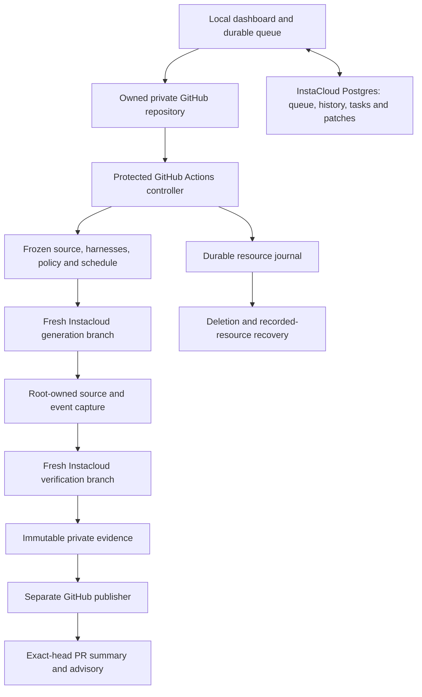

# Fullbeam execution and evidence architecture

Fullbeam compares two frozen native Codex harness releases on the same historical bug-fix tasks and publishes an advisory bound to the candidate PR's exact head. The implemented P0 supports the prepared private RelayDesk seeded repository. The local dashboard connects to real Actions history and queues model/harness experiments. Hosted preflight, calibration, cancellation/recovery, and complete Luna and Sol comparisons have passed pipeline acceptance. Each comparison graded all 12 attempts in 24 fresh environments with confirmed cleanup: Luna produced 11 passes and one functional failure; Sol produced 12 passes. Astra remains pending. Earlier policy failures remain recorded. See [acceptance evidence](acceptance.md).

## Dashboard and operator configuration

The CLI and dashboard share one root `.env`. The local HTTP server binds to `127.0.0.1`, validates host/origin and mutation tokens, and keeps provider credentials server-side. It reads actual workflow artifacts for history, progress, task comparisons, native harness files, usage, and estimated costs. It never creates synthetic successful history.

Dashboard requests are persisted with repository identity and an input digest in InstaCloud Postgres. One worker prepares each owned configuration PR and records a dispatch intent before the GitHub API call. On restart, it resumes queued work and reconciles dispatched intents by their unique trigger, protected controller head, and operation. An unconfirmed dispatch remains pending rather than being submitted again. A repository-scoped Postgres advisory lock prevents competing workers; only one comparison is dispatched at a time by this queue. Undispatched work waits while the dashboard process is stopped. Already-dispatched workflows continue in GitHub Actions. Versioned SQL migrations and a one-time import preserve previous local queue/history records. A database failure does not silently create another queue.

An explicit attempt-review action publishes a draft PR from the selected attempt's verified generation artifact. Its orphan base commit contains the frozen task and harness bytes; its child commit contains the exact captured output, including deletions and executable modes. Separate immutable branch identities bind the comparison, attempt, source, and generation hashes. The publisher verifies private repository identity, author ownership, commit ancestry, and full tree contents before reusing a branch or PR; it never force-updates refs. Workflow metadata, credential paths, and known configured secrets are rejected before Git object creation. Hidden references, verifier code, and logs are not inputs. The dashboard retains the frozen review input and PR receipt in Postgres without altering the evaluation report.

## Trusted controller and repository data

Setup installs controller code under `.fullbeam/controller/` in the dedicated repository. Evaluation uses a manually dispatched workflow checked out at the protected default-branch commit. It separately freezes the candidate head, the PR baseline, and the benchmark/policy commit. Candidate configuration, instructions, skills, and source are fetched as bytes; candidate scripts and workflows never execute on the privileged controller.

The controller starts through a local JavaScript action included in that protected payload. GitHub supplies job-scoped artifact credentials to this action, which passes them directly to the trusted controller process for durable recovery checkpoints. They are never written to an environment file or sent to InstaCloud. The wrapper forwards cancellation signals and preserves the controller's exit status.

The ordinary controller has repository read permissions. Publishing runs separately with narrowly scoped PR/check writes. Seed creation, repository configuration, and approved reference merges use the local bootstrap credential, not the ordinary evaluation token. Candidate PRs that also alter application, controller, verifier, or benchmark-policy files are rejected by the harness-only path.

Historical intake verifies real issue/PR association and the supported squash-merge provenance. Source is exported as normalized file records without the original Git object store. The generation branch creates a new single-commit Git repository containing only the declared frozen files. Reference implementations, hidden acceptance checks, prior results, and answer-bearing Git history are kept outside generation inputs.

The first comparison changes a general verification skill while retaining the selected model/settings and budgets. A later model-only experiment is a separate declared comparison; bundled changes cannot be attributed to one component.

Each release's `.codex/config.toml` determines its model and reasoning effort, independent of the operator's bootstrap defaults. `AGENTS.md` provides native repository instructions. `.agents/skills/NAME/SKILL.md` and its resources provide native skills; root `skills.md` is an index rather than a skill loader. Managed `.fullbeam/` and `.github/` trees are excluded from native harness discovery except the explicit `.fullbeam/release.yaml` declaration. Historical captures retain their original bytes, including the two inert nested instruction documents selected by the older resolver; those documents contain no hidden reference or verifier. Reports classify semantic model/effort changes as `MODEL_ONLY`, other supported harness changes as `HARNESS_ONLY`, and combined changes as `BUNDLE`. TOML formatting alone does not invent a model/harness difference.

Generation receives a stable controller submission policy followed by the original issue text verbatim. Both releases receive the same allowed-source and protected-file instructions, including the distinction between protected `tests/public/` and writable `tests/agent/`. The original issue snapshot/hash is retained separately from an immutable full execution input, its hash, and the policy hash. This policy prompt was added after the first complete live comparison exposed that the controller had enforced protected paths without including those instructions in the model prompt. The subsequent Luna comparison produced 12 policy-valid submissions and completed independent grading. Old evidence remains unchanged; cross-version differences must account for this controller correction.

## Instacloud adapter and immutable templates

`src/execution/instacloud.ts` wraps pinned `insta@0.1.0` lifecycle/compute commands and captures authenticated hosted MCP schemas. CLI auto-update is disabled with `INSTA_NO_AUTOUPDATE=1`; the environment is explicitly production. Every invocation uses `--agent`, with an isolated temporary HOME and separate project working directories. Official project linking establishes the appropriate agent session when required; durable agent credentials follow the CLI's verified authentication path. Approval or policy denials are reported, never retried as a human identity.

Generation and verification use **different empty template projects**. Branch cloning copies provider state, so templates must have no task contents, hidden tests, management credentials, model credentials, or attached data services. Setup verifies empty secret inventory, builds trusted runtime source remotely, and requires digest-addressed deployment images. Each child is checked for the exact image and confirmed always-on service state before work is transferred. Existing immutable templates are reused, not silently redeployed.

The dashboard's Postgres service lives in a separate app project. Its database URL is never bound to generation or verifier VMs and is not passed to candidate code. The current app database uses the user's original project `8306db8f-9f91-49f4-9d49-db561845e6f0`; generation and verification retain their distinct existing projects.

Project-allocation intent is persisted before creation. If the provider creates a project but its response is lost, setup recovers only one exact organization/name match backed by that intent; ambiguous or unrelated matches are rejected. Attempt branches use deterministic Fullbeam correlation names. A durable journal records intent before branch allocation and the returned identity before work. GitHub Actions uploads journal events before proceeding. Manual GitHub Actions reruns are rejected before allocation because artifact names are immutable within a run ID; retries use a fresh dispatch linked to the prior comparison.

The internal adapter implements `preflight`, `createAttemptEnvironment`, `putBundle`, `start`, `poll`, `collect`, and `destroy`. These are application interfaces, not names of an invented Instacloud SDK. The actual transport is short authenticated `compute exec` requests invoking the trusted supervisor with argv. It does not rely on a shell expression, interactive stdin, or a model-length control-plane call.

The supervisor writes bounded individual file records. Records carry normalized paths, exact bytes, sizes, modes, and SHA-256 digests. Both ends reject traversal, duplicate paths, malformed data, links, special files, and size-limit violations. Uploads and artifact downloads use 24 KiB chunks. Final artifact digest verification detects missing or changed bytes.

## Remote operating-system boundaries

| Context                            | UID / authority                | Accessible material                                                                                       |
| ---------------------------------- | ------------------------------ | --------------------------------------------------------------------------------------------------------- |
| Trusted supervisor and model proxy | Root inside the remote runtime | Attempt input, private status/results, scoped model configuration and real OpenAI key for generation only |
| Native agent                       | UID 10001                      | Historical source, selected native harness, isolated HOME, temporary attempt model token                  |
| Application build and server       | UID 10003                      | Submitted source and fixed runtime dependencies; no hidden grader or model credential                     |
| Independent verifier               | UID 10002                      | Root-installed, digest-verified grader module and HTTP access to the application                          |

The underlying model key stays in the root supervisor/proxy context. The native agent receives an expiring attempt token for a loopback proxy restricted to POST `/v1/responses` and the frozen model. The proxy permits local function/custom tools, their namespaces, and client-executed tool search; hosted web tools, arbitrary endpoints, background requests, and unrelated response retrieval are rejected. GitHub and Instacloud management credentials never enter either remote role.

Native execution uses Codex `0.125.0`, an isolated HOME, narrowly scoped project trust, and native Landlock workspace-write sandboxing. The supervisor separately seals `.git`, `.codex`, `.agents`, and existing root `AGENTS.md`/`skills.md` with root ownership and no write bits under a root-owned sticky workspace. This composed boundary preserves metadata protection without requiring the provider's unavailable Bubblewrap namespaces. Other protected paths remain manifest-enforced. The supervisor accepts only five frozen TOML settings and rejects model/reasoning mismatches, then observes native project-layer equality, effective settings (including the Landlock feature), and skill discovery through `config/read` and `skills/list`. Version 0.125 has no `--strict-config`; evidence reports that fact. Component hashes and native discovery are recorded; actual skill use remains UNKNOWN without trace evidence. Every new image must demonstrate the filesystem, metadata, credential, and model/tool boundaries in preflight before readiness.

Before inference, the supervisor reads actual loaded configuration and native skill discovery through the pinned Codex app server. The project configuration layer must be enabled and match the frozen files, effective settings must match the allowed attempt policy, and every expected skill must be discovered. This inspection receives no model key and makes no model request. Both template roles must pass a native-loading probe before runtime readiness. The recorded discovery evidence establishes availability, not proof that the agent used a skill.

The supervisor starts a detached worker, captures bounded stdout/stderr outside the worktree, enforces process timeouts, terminates remaining role-owned processes, and records duration, exit state, source manifests, violations, and raw events. Status and results are inaccessible to the unprivileged agent/application users. The HTTP service listener returns fixed health information and exposes no general-purpose shell.

The workspace snapshot captures new/untracked source files, deletions, executable-mode changes, and protected-file edits. Runtime-generated `.git/`, immutable `node_modules/`, and fixed compiler output `dist/` are explicitly recorded exclusions. They are never accepted as submitted source or copied into fresh verification. Allowed task output is source plus permitted new agent test files; package/build settings, existing tests, and harness files remain protected.

## Independent grading and calibration

The verifier branch receives the historical application and allowed submitted source. A controller-built hidden verifier is injected only after allocation, checked against its digest, and run as a separate user. The application compiles and serves under its own UID. Hidden checks use the HTTP contract and trusted deterministic clock/ID configuration, not a candidate-supplied assertion runner or candidate-writable report.

A passing result requires successful build/startup, all expected unskipped checks, correct report integrity, and no prohibited edit. A zero-check report cannot pass. A captured protected-file edit produces `POLICY_VIOLATION` before independent verification; the invalid submission does not receive a verifier environment. Source compile/startup failures are functional failures; PASS_TO_PASS failures take regression precedence over FAIL_TO_PASS failures. Agent budget expiry remains a timeout outcome. Ambiguous provider/native failures remain incomplete evidence rather than being reclassified to favor either release.

Each task is calibrated against base, accepted reference, and a plausible semantic mutant, each twice. The base must expose the intended failure, the reference must pass, and the mutant must be rejected by meaningful behavior checks. PASS_TO_PASS and FAIL_TO_PASS groups are derived from observations and must both be nonempty. GOLD requires those current observations plus maintainer approval of the task/check mapping. Runtime, verifier, dependency, policy, or task-identity drift requires recalibration.

P0 tasks are explicitly `SEEDED_DEMO`, `PRIVATE`, `SMOKE`, and `KNOWN_TO_AUTHORS`. They test pipeline behavior; they are not a hidden customer-workload holdout. Self-review by the demo owner is recorded honestly and is not represented as independent external validation.

The default automated demo retains SILVER quality and `AUTOMATED_DEMO` qualification. It skips human prompts only for the exact owned seeded fixture after observed seed checks and all six calibration controls per task pass. Comparison admission checks the known task identity/check map and matching automated provenance. Normal human-reviewed admission continues to require GOLD. The report always names the review mode; automated fixture preparation cannot be silently upgraded to human GOLD.

## Scheduling, outcomes, and spend

A frozen schedule contains exactly two current and two candidate attempts per task, with paired block identities. The policy permits at most two pipelines. Comparisons execute ordered waves of up to two pipelines, each with its own executor and deadline; a shared serialized resource journal preserves lifecycle evidence. Worker cleanup is restricted to its own attempts. Wave checkpoints upload after both workers have finished, and a configured measured-cost threshold selects one worker. Each generation and verifier receives a fresh branch and isolated writable state. Unconfirmed cleanup stops new allocations, including a peer's not-yet-started verifier; remaining scheduled slots are retained with an explicit cancellation/infrastructure reason.

Agent budget is 240 seconds, verifier budget 120 seconds, per-attempt setup deadline 600 seconds, and the main controller workflow deadline 180 minutes. Controls add six verifier executions per task; each comparison schedules four generation attempts per task, with a fresh grading environment for each eligible submission. The setup deadline includes allocation, transfer, and launch; every subsequent provider RPC checks the remaining deadline and native CLI timeouts are clamped to it. The overall deadline starts at allocation setup, rather than resetting after launch. Cleanup clears the deadline so deletion can still complete. Initial template bootstrap is separate and each deployment has a 15-minute timeout; cleanup time is additional. Missing or failed slots remain in the schedule and report. A rerun has a new identity linked to its predecessor and never rewrites the old attempt.

Model cost is a standard token-rate estimate only when native usage is sufficiently complete and matches an exact model rate. Explicit per-model `.env` rates take precedence, followed by the operator's matching bootstrap-model rates and the bundled dated catalog. Each comparison stores immutable per-model rate records with source and limitations. Cached input is subtracted before uncached input pricing, and failed attempts count. Truncated or missing usage and unmatched rates produce UNKNOWN rather than zero. Invoice reconciliation, infrastructure spend, cache-write usage, and per-request long-context surcharges remain unmeasured. The dashboard distinguishes later catalog estimates from rate records frozen during execution. A configured measured-spend threshold stops subsequent scheduling; it cannot retroactively cap already-started or unmeasured spending.

The report distinguishes pipeline completeness, task findings, cleanup state, and release decision. Equal aggregate counts cannot hide a critical task regression. Even a complete all-pass seeded report says `NOT_QUALIFIED_FOR_PRODUCTION`. Published comments and checks identify the evaluated head; a changed PR head makes applicability outdated without modifying historical evidence.

## Artifacts and recovery

Evidence objects are hashed, stored privately, and linked from immutable task/comparison/run records. Canonical semantic JSON hashing excludes transport concerns from record identity; source/harness files retain their exact byte and executable-mode identities. Hashes are integrity checks, not signatures of authorship.

Runtime and recovery state remain under `.fullbeam-state/`. InstaCloud Postgres retains dashboard queue state and verified report/task/configuration/patch snapshots with repository binding and content digests. Workflow evidence and journal artifacts request 30-day retention. Approved calibration source and evidence objects are also archived in `.fullbeam/private/` inside the private repository. Immutable evidence files are published atomically; checkpoint uploads exclude temporary files and mutable journal indexes, retaining immutable lifecycle events for recovery. The safe publication payload is separate from raw transcripts, hidden checks, and source. Rendering escapes untrusted report text, and recorded credentials are scrubbed before publication.

Normal completion, exceptions, and cancellation trigger cleanup. Deletion is successful only after a branch listing confirms absence. A separate workflow job and scheduled sweeper recover recorded Fullbeam allocations when the controller stops unexpectedly. Recovery is limited to recorded identities in the configured template projects; scale-to-zero is not treated as deletion.

## Capability and security limits

Preflight must observe authenticated MCP schemas, the pinned CLI/runtime identities, empty templates, at least one generation and verifier environment concurrently, a verified file roundtrip, detached execution, native sandbox enforcement, credential unreadability, a real native model/proxy smoke call, output retrieval, and confirmed deletion. Missing mandatory evidence blocks readiness. Local mocks and deterministic tests never satisfy this gate.

Provider egress restrictions, TTL enforcement, billing granularity, and stronger adversarial isolation remain UNKNOWN. The separate-user proxy is a demonstration guardrail, not a hardened multitenant credential vault. The authorized scope remains the owned private seeded fixture, with browsing and unsupported external tools disabled. There is no claim of customer-security certification, absence of training contamination, production-release readiness, or demonstrated model success from a policy-rejected comparison.
